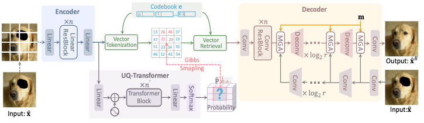

# Reduce Information Loss in Transformers for Pluralistic Image Inpainting

## Overview


##  Some results
completed


masked_gt


completed


masked_gt


## Introduction

This repo. is the implementation of CVPR 2022 paper [Reduce Information Loss in Transformers for Pluralistic Image Inpainting](https://arxiv.org/abs/2205.05076) on QingHua China. It is also a codebase for several tasks, especially friend to image synthesis tasks. 

In our interal works, we have re-implented several works with the help of this repo., including [ICT](https://github.com/raywzy/ICT), [DALL-E](https://arxiv.org/abs/2102.12092), [Taming-transformers](https://github.com/CompVis/taming-transformers), [Edge-Connect](https://github.com/knazeri/edge-connect), and so on. 

Enjoy the code and find its convience to produce more awesome works!


## Data preparation
如果有包含所有图片文件地址的txt：
Please ref. [prepare_data](readme/prepare_data.md) for details.

本项目的训练集：
[gt](data/JDG/train)
[mask](/disks/sda/yutong2333/PUT-main/data/irregular-mask/train)

本项目的验证集
[gt](data/JDG/val)
[mask](/disks/sda/yutong2333/PUT-main/data/irregular-mask/white_mask)

本项目的测试集
[gt](/disks/sda/yutong2333/PUT-main/data/JDG/test_img)
[mask](/disks/sda/yutong2333/PUT-main/data/JDG/test_mask)

注意：训练和验证时，gt和mask可以不一一对应，但测试时必须一一对应

## Installation
Ref. [install_instruction.sh](readme/install_instruction.sh).


## Training
[pvqvae模型的训练]

1)modify the configures in the given yaml file:

查看configs/put_cvpr2022/JDG/pvqvae_JDG_mask_unpaired.yaml中的具体配置

2)The training command is very simple like this:

```
python train_net.py --config_file configs/put_cvpr2022/JDG/pvqvae_JDG_mask_unpaired.yaml --gpu 1 --tensorboard
```


NOTE: The training settings are total controlled by the given yaml config file. So making a good yaml config file is quite important!

The trained logs, models, and sampled images are all saved to `./OUTPUT/exp_name`.

[transformer模型的训练]

1)到/disks/sda/yutong2333/PUT-main/configs/put_cvpr2022/JDG/transformer_JDG_white_mask.yaml中进行配置。

第24行改成训练好的pvqvae模型的路径

dataloader配置同pvqvae模型的yaml文件中dataloader的配置

2)The training command is very simple like this:
```
python train_net.py --config_file configs/put_cvpr2022/JDG/transformer_JDG_white_mask.yaml  --tensorboard
```

## Inference


```
sh /disks/sda/yutong2333/PUT-main/scripts/inference_inpainting_JDG.sh
```
注意：sh文件中的option设置非常重要，需要在内配置img\mask文件路径


The resules will be saved to `./RESULTS/transformer_exp_name/path/to/save`

